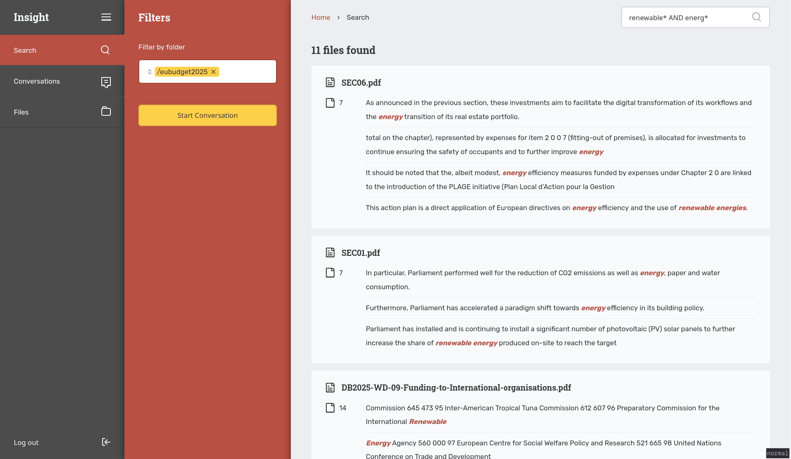
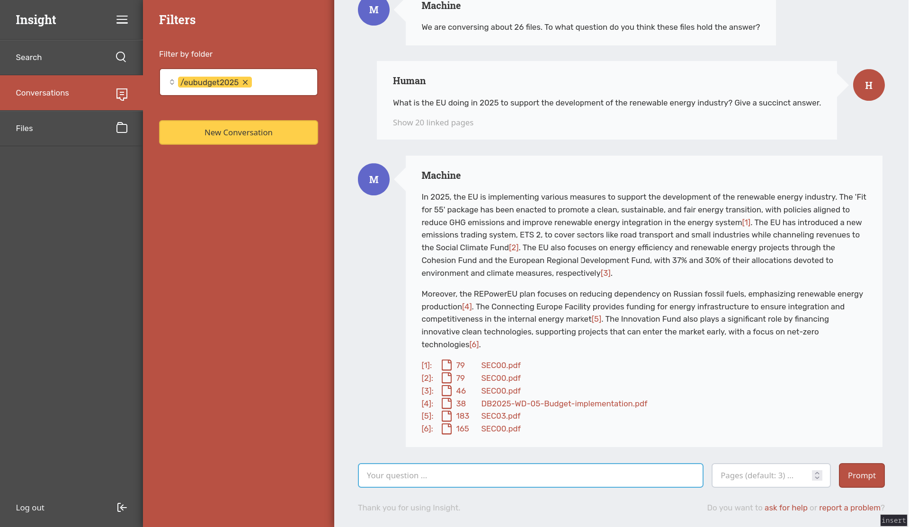
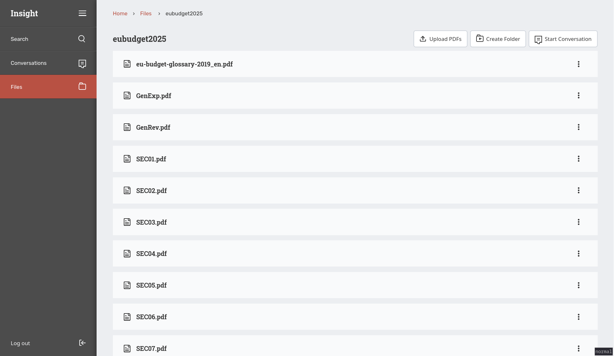

# Insight

Insight allows you to search through a set of PDF documents by keyword, and to
prompt a [LLM](https://en.wikipedia.org/wiki/Large_language_model) about sets
documents through the use of
[RAG](https://research.ibm.com/blog/retrieval-augmented-generation-RAG). It is
designed with the idea of stripping away what you're not interested in, in order
to arrive at what you might be interested in. It tries to accomplish this
by semantically matching information from user-supplied document sets with user
prompts in a conversational form, together with good keyword search.

<p float="left">
  
   
  
</p>

The initial development of Insight was funded by [Follow the
Money](https://ftm.nl) to process large amount of FOIA requests.

## Setting up a development environment

Copy the provided `.env.sample` environment file to a `.env` file:

```
cp .env.example .env
```

You'll need to add a [OpenAI api key](https://platform.openai.com/api-keys) to
the `.env` file as `OPENAI_API_KEY`.

### Certificates

We have to encrypt the traffic to our local keycloak instance because rabbitMQ
is [very serious about following the
spec](https://github.com/rabbitmq/rabbitmq-server/blob/main/deps/rabbitmq_auth_backend_oauth2/README.md#variables-configurable-in-rabbitmqconf),
and won't allow us to use a HTTP key server. Opensearch also requires SSL
certificates to run.

You can easily generate certificates with
[`mkcert`](https://github.com/FiloSottile/mkcert). To generate development
certificates:

```
mkdir certs
cp `mkcert -CAROOT`/rootCA.pem ./certs
mkcert -cert-file ./certs/opensearch.pem -key-file ./certs/opensearch-key.pem opensearch
mkcert -cert-file ./certs/keycloak.pem -key-file ./certs/keycloak-key.pem keycloak localhost
```

After configuration, you can run the development environment:

```
docker-compose up -d
```

After which you can [create a user](https://localhost:8000) before [accessing
the gui](http://localhost:3000).

## Testing

Playwright integration tests are included

```
make install_dependencies
make run_test
```
